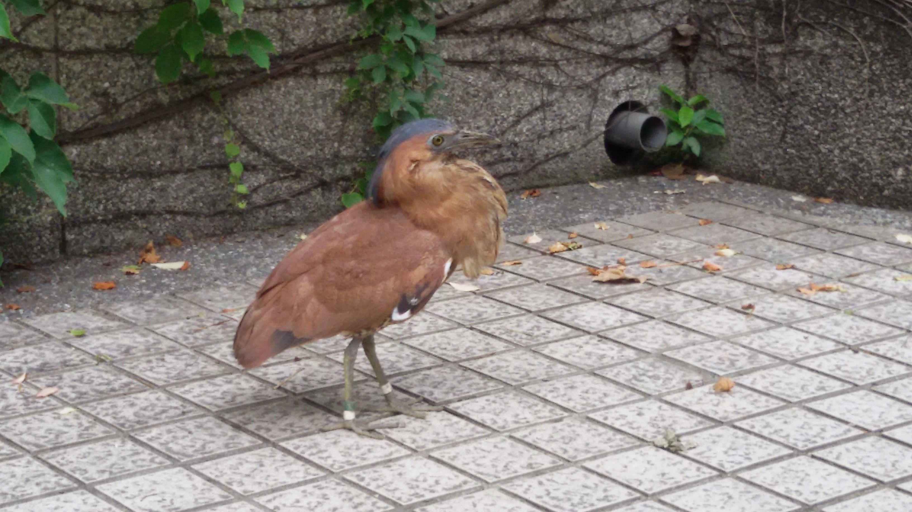
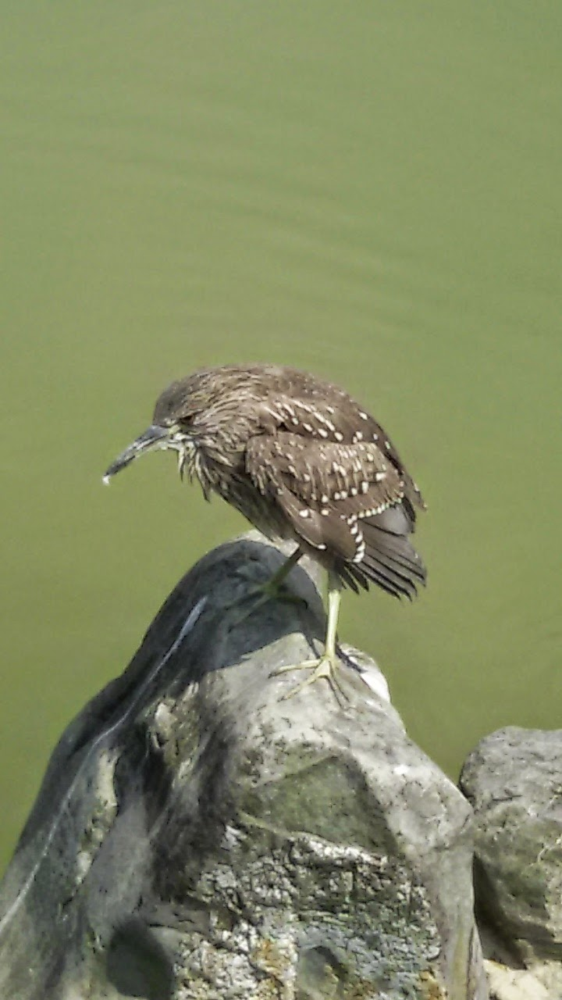
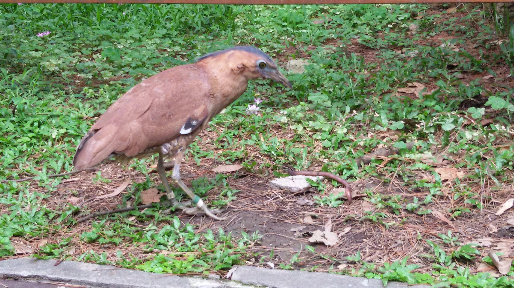

# Tensorflow Malayan Night Heron and Night Heron Image Classifier

This is the repository developed for 'Image Classifier in TensorFlow in 5 Min on [YouTube](https://youtu.be/QfNvhPx5Px8) using this [CodeLab](https://codelabs.developers.google.com/codelabs/tensorflow-for-poets/?utm_campaign=chrome_series_machinelearning_063016&utm_source=gdev&utm_medium=yt-desc#0) by Google as a guide. 

Scientists can use this classifier to automatically label whether a bird image is of a Malayan Night Heron or of a Night Heron.

So the bird on the top is a malayan night heron and the bottom is night heron.

## Requirements

* [docker](https://www.docker.com/products/docker-toolbox)

## Usage 

1. Start the docker image `docker run -it -v <absolute_path_to_this_directory>:/tf_files/ gcr.io/tensorflow/tensorflow:latest-devel`

2. Run the label_image script to label the image in the docker container. `python /tf_files/label_image.py <path_to_file>`

## Results

### Accuracy

Final test accuracy = 76.4%

### Test Images

#### Malayan Night Heron 1

- malayan night heron (score = 0.78996)
- night heron (score = 0.21004)

#### Malayan Night Heron 2

- malayan night heron (score = 0.99932)
- night heron (score = 0.00068)

#### Night Heron

- night heron (score = 0.94634)
- malayan night heron (score = 0.05366)